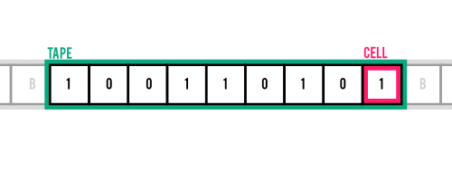

# Universal Turing Machine

A universal Turing machine (UTM) implementation in Python.



## Usage
The machine reads a JSON file as instruction and processes the input accordingly.

```sh
# Multiplication

# 2 * 3
src/universal_turing_machine.py --instructions assets/instructions/multiplication.json \
    --tape "00 000" \
    --render \
    --speed 0.01
  
# 17 * 0
src/universal_turing_machine.py --instructions assets/instructions/multiplication.json \
    --tape "00000000000000000" \
    --render \
    --speed 0.01

# 25 * 1
src/universal_turing_machine.py --instructions assets/instructions/multiplication.json \
    --tape "0000000000000000000000000 0" \
    --render \
    --speed 0.01

# 13 * 24
src/universal_turing_machine.py --instructions assets/instructions/multiplication.json \
    --tape "0000000000000 000000000000000000000000" \
    --render \
    --speed 0.01
```

## JSON Definition

### How it works

1. The JSON is read and converted into a Python dict containing all possible states and instructions.
2. The Python dict is validated and an exception is thrown, should the definition contain any errors (i.e. a state is referenced but never defined).
3. The Python dict is used ad-hoc to find out the following:

- What should be written on the tape (can be any character)
- Which direction the tape should move (right or left)
- What state the machine should switch to (any state as defined in the JSON)

### Structure

```json
{
    "<state-name>": {
        "<character-action>": {
            "write": "<character-to-write>",
            "move": "<right|left>",
          	"nextState": "<next-state-name>"
        }
    }
}
```

### Structure Legend

* state-name: Any state name, usually q0, q1, etc.
* character-action: Define action if Turing machine reads this character
* character-to-write: ONE character to write at current index
* right|left: Which direction to move
* next-state-name: The state to use next

### Example

```json
{
    "q0": {
        " ": {
            "write": "1",
            "move": "right",
          	"nextState": "q1"
        }
    },
    "q1": {
        " ": {
            "write": "0",
            "move": "left",
            "nextState": "q1"
        },
        "1": {
            "write": "0",
            "move": "left",
            "nextState": "qdone"
        }
    }
}
```

### Example Explanation

Assumptions: Initial state is q0 and end state is q1 (can be defined via program arguments)

If q0 detects an empty character it will write a one at its position, move to the right and switch to state q1.  
If q1 detects an empty character it will write a zero at its position, move to the left and switch to state q1.  
If q1 detects a one it will write a zero at its position, move to the left and switch to state qdone.  

Try it yourself!

```bash
src/universal_turing_machine.py --instructions assets/instructions/readme_example.json \
    --begin q0 \
    --end qdone \
    --tape " " \
    --render \
    --speed 1
```

## Author(s)

[Simon Breiter](mailto:hello@simonbreiter.com)  
[Emanuele Mazzotta](mailto:hello@mazzotta.me)

## Credits
[Swizec Teller](http://swizec.com/blog/a-turing-machine-in-133-bytes-of-javascript/swizec/3069)

## License

[MIT License](LICENSE.md) © Simon Breiter, Emanuele Mazzotta

